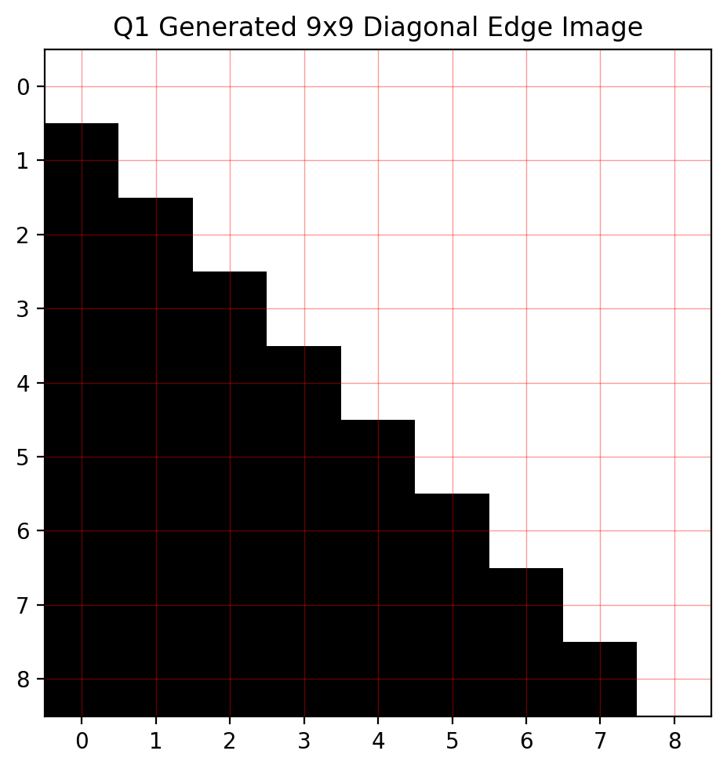
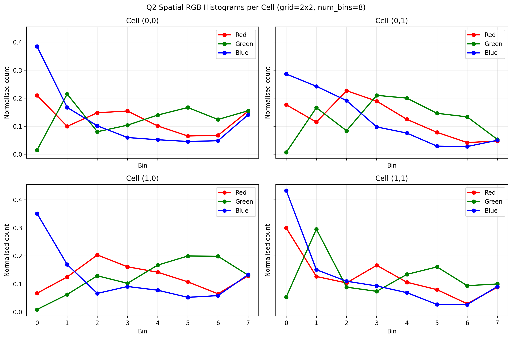
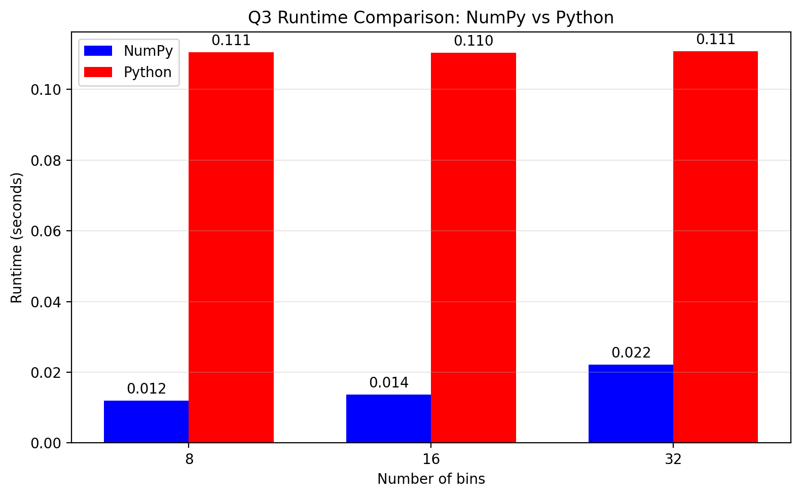
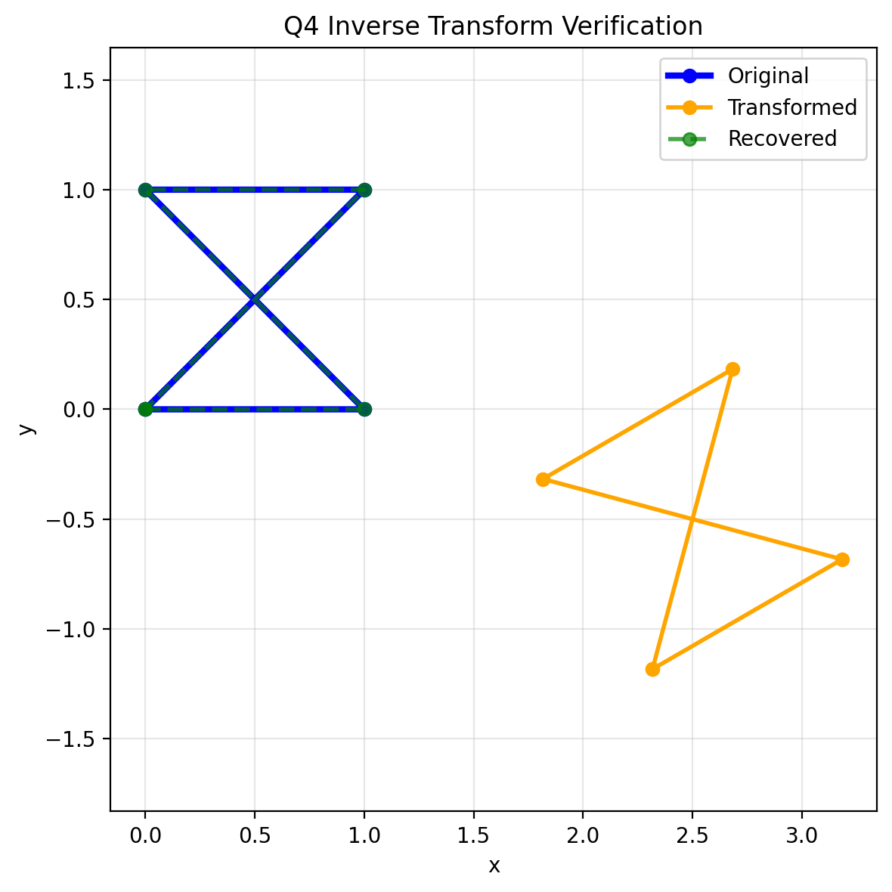
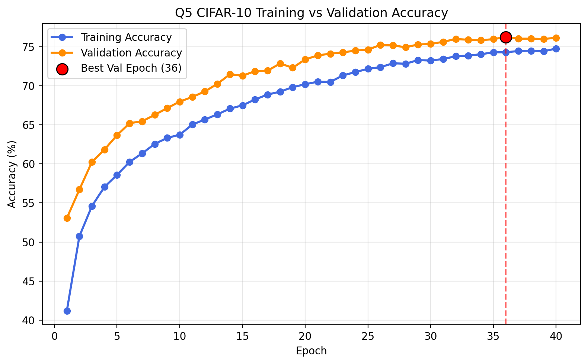

# Computer Vision Toolkit and CIFAR-10 Classification

## Overview

This project explores a range of fundamental computer vision techniques, image processing algorithms, feature engineering methods, and deep learning approaches for image classification.

The repository combines classical computer vision concepts such as edge detection, colour histograms, spatial image descriptors, and geometric transformations with a modern PyTorch-based image classification pipeline for CIFAR-10.

The project demonstrates both mathematical foundations and practical implementation of computer vision systems using Python, NumPy, and PyTorch.

---

## Technologies Used

* Python
* NumPy
* PyTorch
* Matplotlib
* PIL
* Computer Vision
* Machine Learning
* Deep Learning

---

## Project Components

### 1. Edge Detection and Gradient Estimation

Implemented custom gradient estimation methods on synthetic images containing diagonal edges.

The project compares:

* Central finite-difference gradients
* Sobel-style gradients
* Diagonal-corrected gradient estimation

This analysis demonstrates how traditional edge detectors can exhibit directional bias and how diagonal-aware methods can improve edge representation.



---

### 2. Spatial RGB Histogram Descriptors

Developed a spatial colour descriptor that preserves coarse image layout information by dividing an image into multiple regions and computing independent RGB histograms within each spatial cell.

The resulting feature representation captures both colour distribution and spatial structure.



---

### 3. Histogram Optimisation and Performance Analysis

Implemented two colour histogram extraction approaches:

* Vectorised NumPy implementation
* Pure Python loop implementation

Both methods produce identical histogram outputs while demonstrating the performance benefits of vectorised numerical computation.

The runtime comparison highlights the efficiency gains achievable through NumPy-based optimisation.



---

### 4. Geometric Transformations

Derived and implemented the inverse of a rigid two-dimensional transformation involving rotation and translation.

The implementation validates the mathematical derivation by recovering original point coordinates from transformed point sets with negligible reconstruction error.



---

### 5. CIFAR-10 Image Classification

Developed a patch-based Multi-Layer Perceptron (MLP) image classifier using PyTorch.

Rather than processing entire images directly, the model first divides images into non-overlapping patches and projects each patch into an embedding space before classification.

Key architectural features include:

* Patch extraction and embedding
* Layer Normalisation
* Batch Normalisation
* GELU activations
* Dropout regularisation
* AdamW optimisation
* Label smoothing
* Cosine Annealing learning rate scheduling
* Data augmentation

---

## Model Architecture

```text
CIFAR-10 Image
      │
      ▼
Patch Extraction
      │
      ▼
Patch Embedding Layer
      │
      ▼
Layer Normalisation
      │
      ▼
Flatten Patch Embeddings
      │
      ▼
MLP Classifier
      │
      ▼
10-Class Prediction
```

---

## Classification Results

| Metric              | Result |
| ------------------- | ------ |
| Training Accuracy   | 74.30% |
| Validation Accuracy | 76.26% |
| Test Accuracy       | 75.17% |

The patch-based MLP achieved a test accuracy of **75.17%** on the CIFAR-10 dataset while using a significantly simpler architecture than convolutional neural networks.



---

## Key Features

* Custom gradient estimation algorithms
* Spatial image descriptors
* Colour histogram feature engineering
* Vectorised numerical optimisation
* Geometric transformation analysis
* Patch-based image representations
* Deep learning classification
* CIFAR-10 experimentation
* PyTorch model development

---

## Repository Structure

```text
.
├── data/
│   └── flower.jpg
│
├── images/
│   ├── q1_diagonal_edge.png
│   ├── q2_spatial_hist.png
│   ├── q3_runtimes.png
│   ├── q4_inverse_transform_plot.png
│   └── q5_training_curve.png
│
├── outputs/
│   ├── q1_gradients.txt
│   ├── q2_spatial_hist_summary.txt
│   ├── q3_summary.txt
│   ├── q4_inverse_transform_summary.txt
│   └── q5_metrics.txt
│
├── src/
│   ├── q1_edge_gradients.py
│   ├── q2_spatial_hist.py
│   ├── q3_colour_hist.py
│   ├── q4_inverse_transform.py
│   ├── q5_mlp_cifar.py
│   └── utils.py
│
├── requirements.txt
└── README.md
```

---

## Skills Demonstrated

* Computer Vision
* Image Processing
* Feature Engineering
* Edge Detection
* Geometric Transformations
* Deep Learning
* PyTorch
* Machine Learning
* Data Visualisation
* Numerical Computing
* Python Development

---

## Future Improvements

Potential future extensions include:

* Convolutional Neural Networks (CNNs)
* Vision Transformers (ViTs)
* Transfer Learning
* Advanced Feature Descriptors
* Object Detection
* Image Segmentation
* Model Explainability Techniques

```
```
